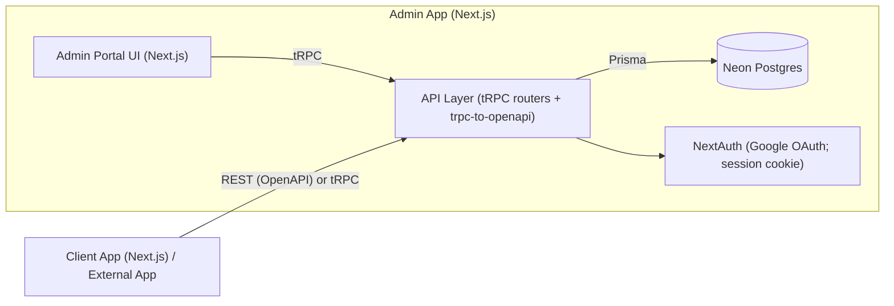

# 🦾 RAMSoc Platform

A unified platform for UNSW Robotics & Mechatronics Society (RAMSoc) to manage members, events, and attendance - built for reliability, scalability, and future multi-tenant support across multiple university societies.

## ⚙️ Tech Stack

| Layer        | Technology/Tooling                                                        |
| ------------ | ------------------------------------------------------------------------- |
| Technology   | TypeScript                                                                |
| Framework    | [Next.js](https://nextjs.org/) (App Router, React 19)                     |
| UI           | [MUI](https://mui.com/)                                                   |
| Auth         | [NextAuth.js](https://next-auth.js.org/) — Google SSO + Email             |
| Database     | [NeonDB](https://neondb.com/) (PostgreSQL)                                |
| ORM          | [Prisma](https://www.prisma.io/)                                          |
| Package Mgmt | [pnpm](https://pnpm.io/) + [Turborepo](https://turborepo.org/) workspaces |
| Hosting      | [Vercel](https://vercel.com/) (separate deployments for Admin & Client)   |

Scaffolded with [create-t3-app](https://create.t3.gg/) and extended into a multi-app monorepo.

## 🧱 Monorepo Structure

```txt
ramsoc-platform/
│
├── apps/
│   ├── admin/       # Admin Portal (management interface + API + Prisma)
│   └── client/      # Member-facing app
│
├── packages/
│   ├── types/       # Shared Zod schemas & TypeScript types
│   └── utils/       # Shared helper functions (server-safe)
│   └── ...          # Other shared packages
│
├── turbo.json       # Turborepo pipeline
├── pnpm-workspace.yaml
├── tsconfig.base.json
└── pull-env.sh      # Pulls .env.local files for both projects
```

Each app is deployed independently on Vercel:

- Admin: [admin.ramsocunsw.org](https://admin.ramsocunsw.org) (includes API routes + Prisma)
- API: [api.ramsocunsw.org](https://api.ramsocunsw.org) (public API for Client + future tenants)
- Client: [app.ramsocunsw.org](https://app.ramsocunsw.org)

## 🌐 API Overview

The RAMSoc Platform API currently ships inside the Admin app (apps/admin) and is consumed by both:

- Admin Portal (internal UI) — calls tRPC directly
- Client App — calls the API over REST (via the OpenAPI bridge) or tRPC (if desired)

It exposes:

- tRPC at `/api/trpc`
- REST (OpenAPI-bridged) routes under `/api/*` via trpc-to-openapi

### Architecture

The API is built on tRPC with optional OpenAPI exposure (trpc-to-openapi) — allowing both type-safe frontend calls and traditional REST-style requests.



Key points:

- Implementation: Next.js Route Handlers under `/api/**`
- tRPC endpoint: `/api/trpc`
- REST endpoints: `/api/<your-openapi-paths>` (bridged from tRPC via trpc-to-openapi)
- Validation: Zod
- Serialization: SuperJSON
- Auth: NextAuth (Google OAuth) → session cookie for protected procedures
- Docs: OpenAPI JSON served from the Admin app (see below)

> Note: In future, the API may be split into its own standalone app for better separation of concerns and scalability.

### OpenAPI Support

An OpenAPI schema is automatically generated from tRPC routers and served at:

```txt
/api/openapi.json
```

You can preview it using Swagger UI for documentation:
• Swagger UI (local): <http://localhost:3000/api/docs>
• Production (future): <https://api.ramsocunsw.org/docs>

When the public API is deployed separately, all frontend apps should read from `NEXT_PUBLIC_API_BASE=https://api.ramsocunsw.org`.

## 🧠 Setup

### 🧾 Prerequisites

- [Node.js 20+](https://nodejs.org/en/download/) (LTS)
- [pnpm 9+](https://pnpm.io/installation)
- [Vercel CLI](https://vercel.com/docs/cli)
- [Git](https://git-scm.com/downloads)

### 1️⃣ Clone & Install

```bash
git clone https://github.com/UNSW-Robotics-and-Mechatronics-Society/ramsoc-platform.git

# or use SSH
# git clone git@github.com:UNSW-Robotics-and-Mechatronics-Society/ramsoc-platform.git

cd ramsoc-platform
pnpm install
```

### 2️⃣ Pull Environment Variables (Auto + Cleanup)

1. Login to Vercel CLI (via RAMSoc account):

   ```bash
   vercel login
   ```

2. Use the included helper script to pull .env.local for both

   Vercel projects:

   ```bash
   chmod +x pull-env.sh
   ./pull-env.sh
   ```

This script:

- Pulls environment variables for both apps/admin and apps/client via vercel env pull
- Automatically removes any AUTH_REDIRECT_PROXY_URL entries
  (these are used for hosted previews and break local development)

After a successful run, you should see:

```bash
...
🎉 All environment variables pulled and cleaned successfully!
---------------------------------------------------------------
- Admin .env.local → apps/admin/.env.local
- Client .env.local → apps/client/.env.local
```

### 3️⃣ Run Development Servers

Run both apps in parallel

```bash
pnpm dev
```

Or run one individually

Access locally:

- Admin → <http://localhost:3000>
- Client → <http://localhost:4000>

4️⃣ Database (Admin Only)

- Prisma schema: apps/admin/prisma/schema.prisma
- Run migrations (Admin only):

  ```bash
  pnpm --filter @ramsoc/admin dev
  pnpm --filter @ramsoc/client dev
  ```

Access locally:

- Admin → <http://localhost:3000>
- Client → <http://localhost:4000>

### 4️⃣ Database (Admin Only)

Run the following to generate local Prisma client:

```bash
pnpm --filter @ramsoc/admin prisma:generate
```

> Note: Client app should never imports Prisma; it consumes data via REST/OpenAPI.

## 🔒 Secrets Management

Environment variables are managed through Vercel Secrets, synced via vercel env pull.
You don’t need to manually edit `.env.local` files — simply run `./pull-env.sh`.

## 🚀 Deployment

Each app is deployed as a separate Vercel project:

| App    | Root Directory | Domain               | Notes                                    |
| ------ | -------------- | -------------------- | ---------------------------------------- |
| Admin  | apps/admin     | admin.ramsocunsw.org | Includes API routes + Prisma             |
| Client | apps/client    | app.ramsocunsw.org   | Uses public API via NEXT_PUBLIC_API_BASE |

DNS is managed in Cloudflare and both subdomains point to cname.vercel-dns.com.

## 🧩 Useful Commands

| Command                          | Description                                 |
| -------------------------------- | ------------------------------------------- |
| pnpm dev                         | Run all apps in parallel                    |
| pnpm build                       | Build all apps                              |
| pnpm lint                        | Lint all workspaces                         |
| pnpm --filter @ramsoc/admin dev  | Run Admin locally                           |
| pnpm --filter @ramsoc/client dev | Run Client locally                          |
| ./pull-env.sh                    | Pull Vercel envs & auto-clean redirect vars |

## 👥 Contributors

See [CONTRIBUTORS.md](CONTRIBUTORS.md) for maintainers, subcommittee members, and contributors.

---

> Built with ❤️ by the RAMSoc IT Team — enabling smarter events, better analytics, and seamless member experiences at UNSW.
